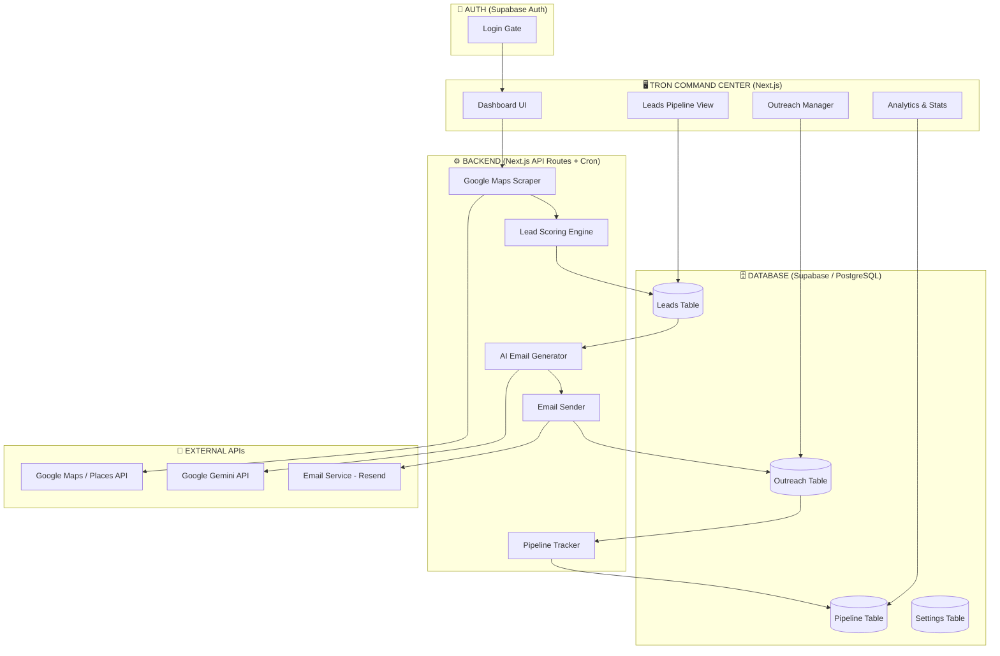

# ACAM — Automated Customer Acquisition Machine

> **Technical Specification v1.1 — For Discussion**
>
> A $0-budget customer acquisition system for [Caelborne.io](https://caelborne.io) that scrapes leads, generates personalized outreach, and automates the sales pipeline — all wrapped in an 80s Tron command center UI.

---

## The One-Liner

ACAM finds businesses that need websites, writes them personalized emails, and tracks every interaction — so you wake up to leads in your inbox without spending a dime.

---

## Resolved Decisions

| Decision | Answer |
|---|---|
| **Hosting** | Standalone website (its own domain or `acam.caelborne.io`), deployed on Vercel — distinct product identity, NOT embedded in Caelborne |
| **Authentication** | Supabase Auth — login-protected, only you can access |
| **Email sender** | `domuskalliaegis@gmail.com` masked via Resend custom domain (e.g., sends as `outreach@caelborne.io` or similar professional alias) |
| **AI provider** | Google Gemini API (user already pays for the top-tier plan — $0 additional cost) |
| **Google APIs** | User has existing Google account; will set up Google Cloud project for Places API key |
| **Database** | New Supabase project under existing account (separate from Guap) |
| **Meta Ads** | Parked for future — ACAM v1 is 100% organic acquisition |

---

## Architecture Overview



---

## Tech Stack

| Layer | Tech | Why |
|---|---|---|
| **Frontend** | Next.js (React) | You know it, it's fast, SSR + API routes in one |
| **Styling** | Vanilla CSS | Full control over the Tron aesthetic, no framework constraints |
| **Database** | Supabase (PostgreSQL) | New project under existing account, free tier, real-time, auth built-in |
| **Auth** | Supabase Auth | Login-protected — only you can access the system |
| **AI** | Google Gemini API | You already pay for the top-tier plan — $0 additional cost |
| **Email Sending** | Resend (with custom domain) | Sends from a professional alias (e.g., `outreach@caelborne.io`), masks your Gmail |
| **Maps Data** | Google Places API | Find businesses + detect missing websites |
| **Hosting** | Vercel | Free tier, standalone site — ACAM is its own product |
| **Cron Jobs** | Vercel Cron or GitHub Actions | Schedule daily scrapes and follow-ups |

### Monthly Cost Estimate

| Service | Cost |
|---|---|
| Vercel hosting | $0 (free tier) |
| Supabase | $0 (free tier — 500MB, 50K rows) |
| Google Gemini API | $0 (already on paid plan) |
| Resend | $0 (free tier — 100 emails/day) |
| Resend custom domain | $0 (included in free tier — you just verify your domain) |
| Google Places API | $0-10/month (depends on volume) |
| **Total** | **~$0-10/month** |

---

## Feature Breakdown

---

### Feature 1: Google Maps Lead Scraper

**What it does**: You press a button, pick a location + business category, and ACAM finds businesses that need websites.

#### How It Works

1. You enter: city/area + business type (e.g., "Miami" + "Restaurants")
2. ACAM queries Google Places API for businesses in that category/area
3. For each result, ACAM checks if they have a website listed
4. Businesses with **no website** (or a clearly bad one) get flagged as leads
5. ACAM pulls: name, address, phone, rating, review count, category, Google Maps link
6. Each lead gets a **score** (0-100) based on:
   - Number of reviews (more reviews = established business = better lead)
   - Rating (higher rating = business is doing well but missing online presence)
   - Category (some industries convert better — configurable)
   - Has phone/email listed (easier to contact = higher score)
7. Leads are saved to the database, deduplicated against existing leads

#### Data Model: `leads` Table

| Column | Type | Description |
|---|---|---|
| `id` | UUID | Primary key |
| `business_name` | text | Name from Google Maps |
| `category` | text | Business category |
| `address` | text | Full address |
| `city` | text | City |
| `state` | text | State |
| `phone` | text | Phone number (if listed) |
| `email` | text | Email (if discoverable) |
| `google_rating` | float | Star rating |
| `review_count` | int | Number of reviews |
| `has_website` | boolean | Whether they have a website |
| `website_url` | text | Their website URL (if any) |
| `website_quality` | text | 'none', 'poor', 'decent' |
| `google_maps_url` | text | Link to their Google Maps listing |
| `lead_score` | int | Computed score (0-100) |
| `status` | text | 'new', 'contacted', 'responded', 'meeting', 'closed', 'dead' |
| `scraped_at` | timestamp | When we found them |
| `notes` | text | Your personal notes |

#### UI Elements
- **Scrape Control Panel**: Input fields for location + category, big "SCAN" button with neon glow
- **Results Feed**: Leads streaming in like a data terminal — each one appearing with a subtle animation
- **Lead Cards**: Show business info, score badge, quick-action buttons (email, skip, save)

---

### Feature 2: The Tron Command Center (Dashboard)

**What it does**: Your mission control. See everything at a glance.

#### Dashboard Sections

**a) Header Bar**
- ACAM logo (glowing, animated)
- Current date/time in monospace digital display
- System status indicator ("ALL SYSTEMS ONLINE" in green glow)

**b) Key Metrics Strip** (top of dashboard)
- Total leads found (all time)
- Leads found this week
- Emails sent this week
- Response rate (%)
- Meetings booked
- Clients closed

Each metric displayed as a **glowing digital counter** that ticks up with animation.

**c) Pipeline Funnel**
- Visual funnel showing: New Leads → Contacted → Responded → Meeting → Closed
- Neon-colored bars with counts, animated transitions when data changes

**d) Activity Feed**
- Real-time feed: "New lead found: Mario's Pizza (⭐4.7, 180 reviews)"
- "Email sent to: Fresh Cuts Barbershop"
- "Response received from: Elite Auto Detailing"
- Styled like a terminal log with timestamps

**e) Quick Actions**
- "Run Scraper" button
- "Generate Emails" button
- "View Pipeline" button

#### The Tron Aesthetic — Technical Implementation

| Element | Implementation |
|---|---|
| **Neon grid background** | CSS grid pattern with animated glow lines using `linear-gradient` + `animation` on a fixed background |
| **Glow effects** | `text-shadow` and `box-shadow` with cyan/magenta color values, multiple layers for bloom |
| **Scanline overlay** | Pseudo-element with repeating `linear-gradient` (1px transparent, 1px rgba dark), low opacity |
| **Monospace type** | Google Fonts: `Orbitron` (headers) + `Share Tech Mono` (data/body) |
| **Card borders** | 1px solid with rgba cyan, `box-shadow` glow, dark translucent background |
| **Animations** | CSS `@keyframes` for: grid pulse, counter tick-up, element boot-in sequence, hover glow intensify |
| **Color variables** | CSS custom properties: `--neon-cyan`, `--neon-magenta`, `--neon-amber`, `--bg-void`, `--text-glow` |

---

### Feature 3: AI-Powered Cold Outreach

**What it does**: ACAM writes personalized emails for each lead and handles the full outreach sequence.

#### How It Works

1. You select leads (or ACAM auto-selects top-scored new leads daily)
2. For each lead, ACAM sends the business info to Google Gemini with a prompt:
   - Include business name, category, rating, review count, whether they have a website
   - Tone: professional but conversational, not salesy
   - Mention specific details about their business (pulled from Google data)
   - Pitch: Caelborne builds custom websites, here's why they need one
3. ACAM generates the email (subject + body)
4. You can: **approve & send**, **edit & send**, or **skip**
5. Emails are sent via Resend from your business email
6. Follow-up sequence (automated):
   - Day 0: Initial email
   - Day 3: Follow-up if no response ("Just wanted to make sure this didn't get buried...")
   - Day 7: Final follow-up ("Totally understand if now isn't the right time...")

#### Data Model: `outreach` Table

| Column | Type | Description |
|---|---|---|
| `id` | UUID | Primary key |
| `lead_id` | UUID | FK to leads table |
| `email_subject` | text | Generated subject line |
| `email_body` | text | Generated email content |
| `email_type` | text | 'initial', 'followup_1', 'followup_2' |
| `status` | text | 'draft', 'approved', 'sent', 'opened', 'replied', 'bounced' |
| `sent_at` | timestamp | When sent |
| `opened_at` | timestamp | When opened (if tracked) |
| `replied_at` | timestamp | When they replied |

#### UI Elements
- **Email Preview Cards**: See the generated email in a terminal-styled window, with approve/edit/skip buttons
- **Outreach Queue**: List of pending emails, sortable by lead score
- **Sent Tracker**: Visual timeline showing each lead's outreach journey

---

### Feature 4: Portfolio Showcase Generator

**What it does**: Auto-generates case study content from your completed projects to use in outreach.

#### How It Works

1. You input details about a completed project (client name, industry, before/after screenshots, results)
2. ACAM uses AI to write a mini case study
3. Generates a shareable link (hosted on your ACAM domain or Caelborne subdomain)
4. These links get included in outreach emails automatically ("Here's a site I built for a [similar business type]...")

#### Data Model: `portfolio` Table

| Column | Type | Description |
|---|---|---|
| `id` | UUID | Primary key |
| `client_name` | text | Client name |
| `industry` | text | Their industry |
| `description` | text | AI-generated case study text |
| `before_url` | text | Screenshot or URL of their old site (if any) |
| `after_url` | text | The Caelborne-built site URL |
| `showcase_url` | text | Public shareable link |
| `created_at` | timestamp | When created |

> [!NOTE]
> This is the lowest-priority feature. The scraper + outreach engine is what drives revenue. This is a nice-to-have that makes your emails more compelling.

---

### Feature 5: Smart Pipeline Automation

**What it does**: Tracks every lead through your sales process and learns what works.

#### Pipeline Stages

```
NEW → CONTACTED → RESPONDED → MEETING → PROPOSAL → CLOSED WON / CLOSED LOST
```

#### Intelligence Layer (rule-based to start)

- **Industry analysis**: Track which business categories have the highest response rate. Suggest focusing scraping on those.
- **Email optimization**: Track which email styles (short vs. long, question vs. statement openers) get more replies. Feed this back to the AI prompt.
- **Timing insights**: Track which days/times get the best open rates. Schedule sends accordingly.
- **Weekly digest**: Auto-generated summary email to you with key stats and recommendations.

#### Data Model: `pipeline_events` Table

| Column | Type | Description |
|---|---|---|
| `id` | UUID | Primary key |
| `lead_id` | UUID | FK to leads |
| `from_status` | text | Previous stage |
| `to_status` | text | New stage |
| `changed_at` | timestamp | When the change happened |
| `notes` | text | Optional context |

---

## Project Structure

```
ACAM/
├── src/
│   ├── app/                     # Next.js app router
│   │   ├── layout.js            # Root layout with Tron styling
│   │   ├── page.js              # Login page (Supabase Auth)
│   │   ├── dashboard/
│   │   │   └── page.js          # Main command center (post-login)
│   │   ├── leads/
│   │   │   └── page.js          # Leads list + scraper controls
│   │   ├── outreach/
│   │   │   └── page.js          # Email generation + queue
│   │   ├── pipeline/
│   │   │   └── page.js          # Pipeline funnel view
│   │   ├── portfolio/
│   │   │   └── page.js          # Case study manager
│   │   ├── settings/
│   │   │   └── page.js          # API keys, email config, preferences
│   │   └── api/
│   │       ├── scrape/
│   │       │   └── route.js     # Google Maps scraping endpoint
│   │       ├── leads/
│   │       │   └── route.js     # CRUD for leads
│   │       ├── outreach/
│   │       │   ├── generate/
│   │       │   │   └── route.js # AI email generation (Gemini)
│   │       │   └── send/
│   │       │       └── route.js # Send emails via Resend
│   │       ├── pipeline/
│   │       │   └── route.js     # Pipeline stage updates
│   │       └── cron/
│   │           ├── followup/
│   │           │   └── route.js # Auto follow-ups (daily cron)
│   │           └── digest/
│   │               └── route.js # Weekly stats digest
│   ├── components/
│   │   ├── tron/                # Tron UI system
│   │   │   ├── TronGrid.js      # Neon grid background
│   │   │   ├── TronCard.js      # Glowing bordered card
│   │   │   ├── TronButton.js    # Neon glow button
│   │   │   ├── TronCounter.js   # Animated number display
│   │   │   ├── TronTerminal.js  # Activity feed terminal
│   │   │   ├── TronFunnel.js    # Pipeline funnel viz
│   │   │   └── TronMetric.js    # Single metric display
│   │   ├── AuthGate.js          # Protects routes behind login
│   │   ├── LeadCard.js
│   │   ├── EmailPreview.js
│   │   └── PipelineBoard.js
│   ├── lib/
│   │   ├── google-maps.js       # Google Places API wrapper
│   │   ├── gemini.js            # Google Gemini email generation
│   │   ├── resend.js            # Email sending (masked domain)
│   │   ├── scoring.js           # Lead scoring logic
│   │   └── supabase.js          # Database client + auth
│   └── styles/
│       ├── globals.css          # Tron design system (colors, fonts, grid, glow)
│       └── animations.css       # All keyframe animations
├── public/
│   └── fonts/                   # Orbitron, Share Tech Mono
├── .env.local                   # API keys (gitignored)
├── package.json
└── next.config.js
```

---

## Build Order

| Phase | What We Build | Estimated Time |
|---|---|---|
| **Phase 1** | Project setup + Supabase Auth + Tron design system + grid background + login screen | 1 session |
| **Phase 2** | Database schema (Supabase) + Google Maps scraper + leads page | 1-2 sessions |
| **Phase 3** | AI email generation (Gemini) + outreach page + email sending (Resend w/ masked domain) | 1-2 sessions |
| **Phase 4** | Dashboard with live metrics + pipeline tracking | 1 session |
| **Phase 5** | Follow-up automation + weekly digest + smart recommendations | 1 session |
| **Phase 6** | Portfolio showcase generator | 1 session |
| **Phase 7** | Polish, animations, sound design, final Tron aesthetic pass | 1 session |

---

## Verification Plan

### Automated Testing
- Run `npm run build` after each phase to verify no build errors
- Test each API route individually using the browser dev tools or curl commands

### Browser Testing
- After Phase 1: Verify the Tron grid background renders, fonts load, glow effects work
- After Phase 2: Verify scraping returns real businesses, leads appear in the UI
- After Phase 3: Verify email generation produces quality content, sending works via Resend
- After Phase 4: Verify dashboard metrics update dynamically
- After Phase 5: Verify cron-triggered follow-ups send correctly

### Manual Verification
- Scrape a real location and verify the leads are real businesses without websites
- Send a test email to yourself and verify it arrives and looks good
- Walk through the full pipeline: scrape → generate email → approve → send → track response

---

## Future Expansion: Meta Ads Engine (Parked)

> [!NOTE]
> When ready to add paid ads, the architecture supports plugging in a Meta Marketing API integration. The infrastructure (tracking, analytics, dashboard) will already be built — we'd just add the ad platform connector and creative deployment pipeline.

---

## Setup Checklist (Before Phase 1)

- [ ] Set up Google Cloud project + enable Places API + get API key
- [ ] Create new Supabase project (under existing account)
- [ ] Get Gemini API key from Google AI Studio
- [ ] Verify a custom domain in Resend for professional email masking
- [ ] Decide on domain: standalone (`acam.io`, etc.) or subdomain (`acam.caelborne.io`)
